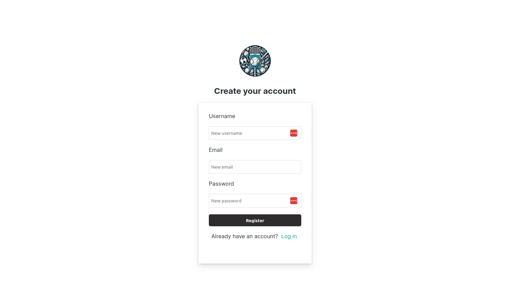
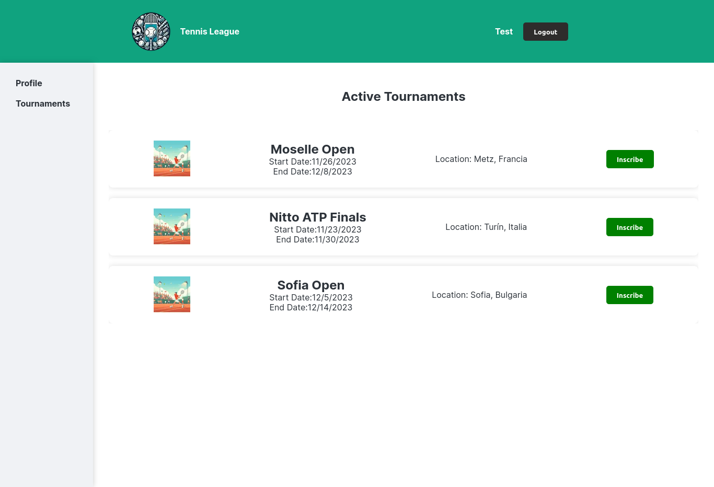

# Challenge Project MERN Full Stack App with Next.js 14.0, React 18, MongoDB, Next.js API routes, Sass




An application with authentication system that manages two types of roles, also allows the CRUD management of users and tournament lists

Check out the site here: [https://lively-field-0447c1a0f.4.azurestaticapps.net/](https://lively-field-0447c1a0f.4.azurestaticapps.net/)

---

## Features

In this project, it demonstrates the ability to:

- The Authentication of Users.
- Alternative Authentication Google OAuth.
- Admictionation is safe of credentials.
- CRUD Operation on users and tournaments DB.
- List of tournaments.
- Registration of Tournaments.

---

## Future Features

- Upload tournament image.
- Add payment gateway.

---

## Build Setup

```bash
# clone repository
git clone https://github.com/Johndev85/tennis-league-app.git

# go project file
 cd tennis-league-app

# install dependencies
npm install

# serve with hot reload at localhost:5173/
npm run dev

# build for production with minification
npm run build

```

---

## Technologies

- Javascript
- React with Nextjs - Frontend
- Nextjs API Routes - Backend
- Sass - CSS
- MongoDB Atlas - DB Cloud
- Vercel - Deploy

---

## Contribute

If you want to contribute with this project, just make a Pull Request explaining the improving ✨.

---

## License

The MIT License (MIT)

---
